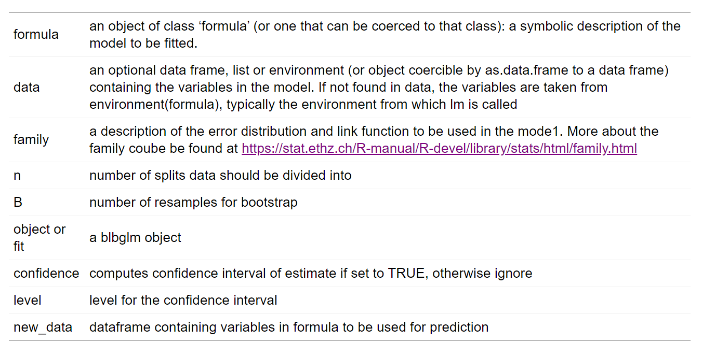

# blbglmpar: Generalized Linear Model with Little Bag of Bootstraps and Parallelization

## Introduction

The purpose of this package is to provide an alternative to existing Generalized Linear Model fitting package -`glm` - equipped with both parallelization and bootstrap capabilities. The goal is that one should be able to replace the package  `glm` with `blbglmpar` when there is a need for parallelization and bootstrap capabilities and things will just work. 

## Dependencies

`blbglmpar` uses a couple of packages so as to achieve the goal. The list of packages which serves as dependencies for include:

  * [`furrr`](https://github.com/DavisVaughan/furrr) for parallelization
  * [`tidyverse`](https://www.tidyverse.org/) for efficient data manipulation
  * [`vroom`](https://www.tidyverse.org/blog/2019/05/vroom-1-0-0/) for efficient lazy loading of large files data
  
## Usage

Loading blbglmpar into R-session.

```{r setup}
library(blbglmpar)
```
blbglmpar fits models using the template `blbglm(formula= formula, data = data, m = 10, B = 200, family = gaussian)`

The default behaviour of blbglmpar is that it does not run using parralellization and family is gaussian. Thus it works like the classical lm function but with bootstrap.

## Arguments

```{r}
a1 <- c("formula", "an object of class 'formula' (or one that can be coerced to that class): a symbolic description of the model to be fitted.")
a2 <- c("data", "an optional data frame, list or environment (or object coercible by as.data.frame to a data frame) containing the variables in the model. If not found in data, the variables are taken from environment(formula), typically the environment from which lm is called")
a3 <- c("family", "a description of the error distribution and link function to be used in the mode1. More about the family coube be found at https://stat.ethz.ch/R-manual/R-devel/library/stats/html/family.html")
a4 <- c("n", "number of splits data should be divided into")
a5 <- c("B", "number of resamples for bootstrap")
argframe <- matrix(rbind(a1,a2,a3,a4,a5), nrow = 5, ncol = 2)
argframe %>%
  kable() %>%
  kable_styling(bootstrap_options = c("striped", "hover"))
```



## Logistic regression example

We build the logistic model using family = "binomial" i.e `blbglm(admit ~ gre+gpa,data = df_bin, m = 5, B = 10, family = "binomial")`

```{r}
df_bin <- read.csv("https://stats.idre.ucla.edu/stat/data/binary.csv")
df_bin$rank <- as.factor(df_bin$rank)
fit_bin <- blbglm(admit ~ gre+gpa,data = df_bin, m = 5, B = 10, family = "binomial")
```

`coef(object, ...)` computes the coefficient of the blbglm object

```{r}
coef(fit_bin)

#>   (Intercept)           gre           gpa 
#> -0.4963597652  0.0005707091  0.1370519761
```

We compute the confidence interval for the coefficients of gre and gpa. For all confidence interval, the default is alpha level of .05. confin provides confidence intervals for model parameters. It is of the form `confint(object, parm = NULL, level = 0.95, ...)`

```{r}
confint(fit_bin, c("gre", "gpa"))

#>              2.5%       97.5%
#> gre -0.0001285517 0.001256556
#> gpa -0.0464223088 0.364724564
```

We compute the variance of the the fit.
sigma is of the form `sigma(object, confidence = FALSE, level = 0.95, ...)`

```{r}
sigma(fit_bin)

#> [1] 0.4476883
```

```{r}
sigma(fit_bin, confidence = TRUE)

#>     sigma       lwr       upr 
#> 0.4476883 0.4121311 0.4744191
```
To obtain predictions and optionally estimates standard errors of those predictions from a fitted generalized linear model object.
We predict the outcome for new data. The prediction function is of the form predict(object, new_data, confidence = FALSE, level = 0.95, ...)

```{r}
predict(fit_bin, data.frame(gre = c(600, 560), gpa = c(3.67, 3.5)))

#>         1         2 
#> 0.3490464 0.3029192
```
```{r}
predict(fit_bin, data.frame(gre = c(600, 560), gpa = c(3.67, 3.5)), confidence = TRUE)

#>         fit       lwr       upr
#> 1 0.3490464 0.2622971 0.4509742
#> 2 0.3029192 0.2311668 0.3883652
```

## Parallelization

We must specify the number of workers to use parallelization feature. 

```{r}
library(furrr)

#> Loading required package: future

suppressWarnings(plan(multiprocess, workers = 2))

```

```{r}
df_bin <- read.csv("https://stats.idre.ucla.edu/stat/data/binary.csv")
df_bin$rank <- as.factor(df_bin$rank)
fit_bin <- blbglm(admit ~ gre+gpa,data = df_bin, m = 5, B = 100, family = "binomial")
coef(fit_bin)

#>   (Intercept)           gre           gpa 
#> -0.5871332456  0.0004905452  0.1849112900

```
```{r}
df_bin <- read.csv("https://stats.idre.ucla.edu/stat/data/binary.csv")
df_bin$rank <- as.factor(df_bin$rank)
fit_bin <- blbglm(admit ~ gre+gpa,data = df_bin, m = 5, B = 100, family = "binomial")
coef(fit_bin)

#>   (Intercept)           gre           gpa 
#> -0.5311081276  0.0005446364  0.1557053741
```

We stop the workers

```{r}
future:::ClusterRegistry("stop")
```

